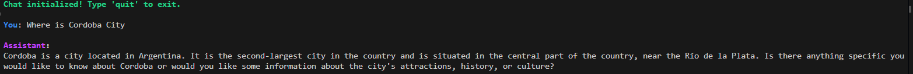

# Llama3.2:3B Fine-Tuning with Unsloth on BAAI/Infinity-Instruct

This repository demonstrates the fine-tuning of the [Llama3.2:3B](https://github.com/example/llama3.2) model using the [BAAI/Infinity-Instruct](https://huggingface.co/datasets/BAAI/Infinity-Instruct) dataset and the **Unsloth** library. The fine-tuned model, [MateoRov/Llama3.2-3b-SFF-Infinity-MateoRovere](https://huggingface.co/MateoRov/Llama3.2-3b-SFF-Infinity-MateoRovere), is now available on Hugging Face and can be used for conversational AI tasks.

---

## Features
- Fine-tunes the Llama3.2:3B model for supervised instruction-following tasks.
- Utilizes **Unsloth** for efficient and scalable training.
- Leverages the [BAAI/Infinity-Instruct](https://huggingface.co/datasets/BAAI/Infinity-Instruct) dataset for high-quality supervised fine-tuning.
- Provides a terminal-based chat interface using the fine-tuned model.

---

## Setup and Usage

### 1. Clone the Repository
```bash
git clone https://github.com/Mateorovere/FineTuning-LLM-Llama3.2-3b.git
cd FineTuning-LLM-Llama3.2-3b

```

### 2. Install Dependencies

Install the required Python packages:

```bash
pip install -r requirements.txt

```
And install [PyTorch](https://pytorch.org/get-started/locally/)

### 3. Run Fine-Tuning (Optional)

If you want to perform fine-tuning yourself, open the Llama_3_2_3B_Finetuning.ipynb notebook and follow the steps to train the model using the Unsloth library and the BAAI/Infinity-Instruct dataset.

Both the Llama_3_2_3B_Finetuning.ipynb and the inference.ipynb are ment to run on google collab

### 4. Use the Fine-Tuned Model as a Chatbot
Run the main.py script to interact with the fine-tuned model in the terminal:

```bash
python main.py

```

---

## Model Information
The fine-tuned model is hosted on Hugging Face:
- Model: [MateoRov/Llama3.2-3b-SFF-Infinity-MateoRovere](https://huggingface.co/MateoRov/Llama3.2-3b-SFF-Infinity-MateoRovere)
- Dataset: [BAAI/Infinity-Instruct](https://huggingface.co/datasets/BAAI/Infinity-Instruct)


### Contributing

Contributions are welcome! Please fork the repository and create a pull request with your proposed changes.